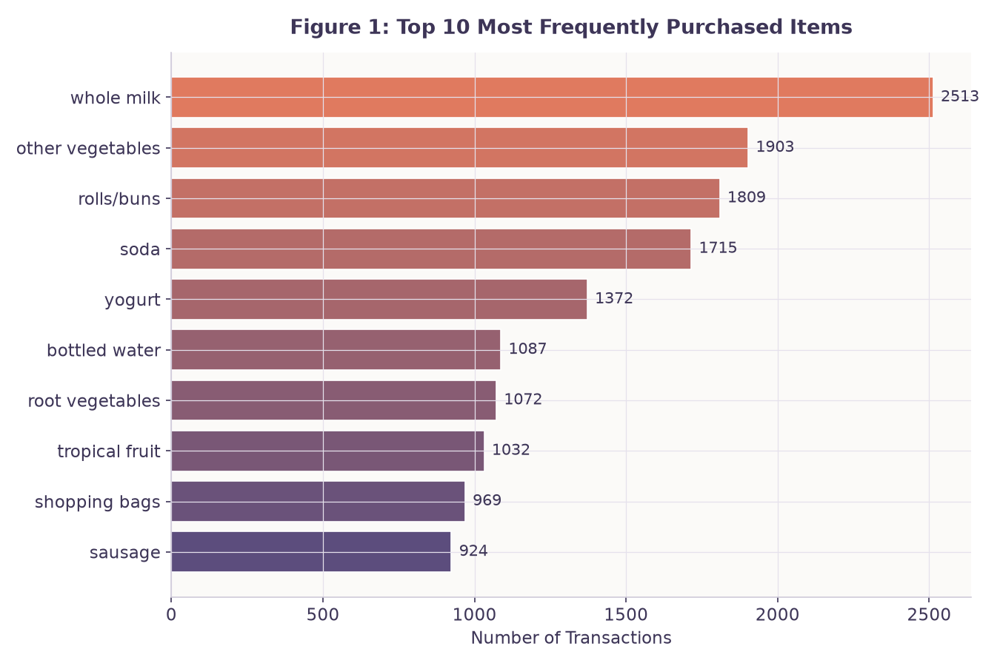
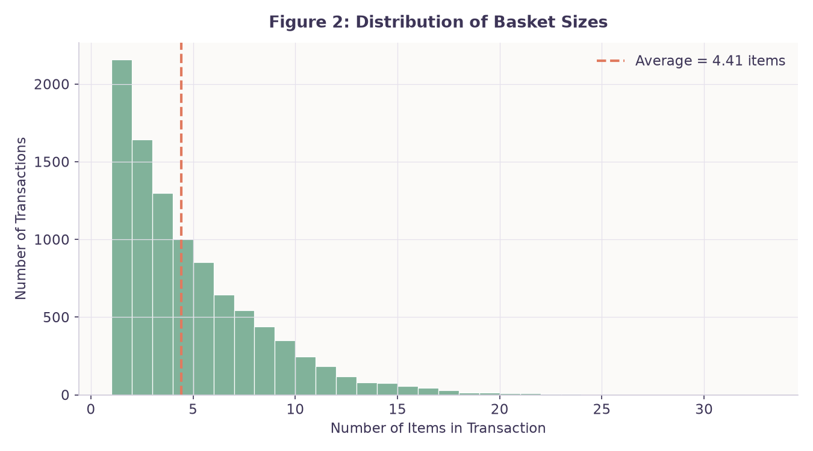
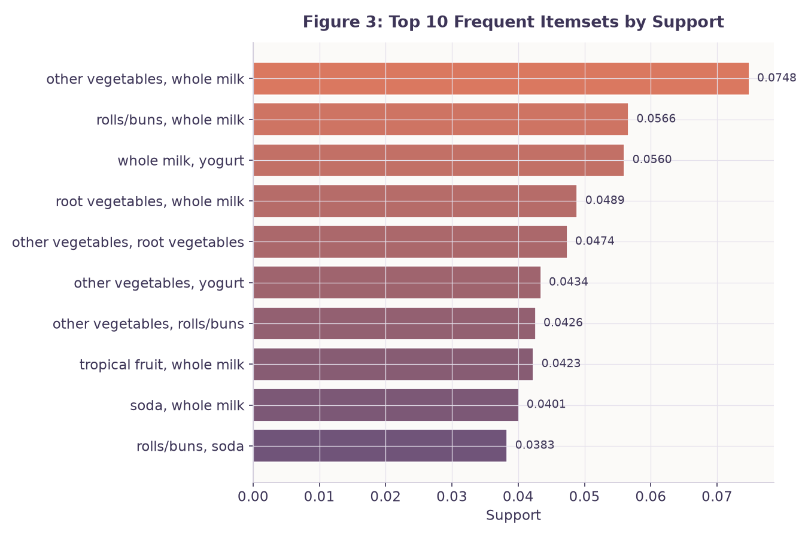
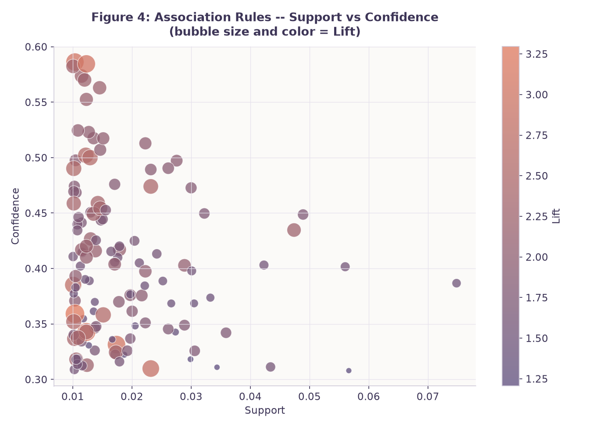
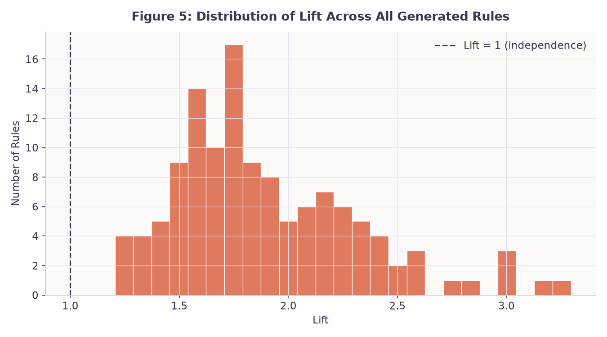

# Groceries Association Rule Analysis

Association rule mining applied to nearly 10,000 real grocery transactions, using the Apriori algorithm to find out which products customers tend to buy together — and how strong those relationships actually are.

Built for the *Unsupervised Learning Method* course assignment on association rule learning.

---

## About this project

Most people's grocery baskets aren't random — buying bread often comes with buying butter, and buying beef often comes with buying vegetables to cook alongside it. This project quantifies that intuition using the **Groceries dataset**: 9,835 real transactions across 169 distinct products.

The question this analysis answers isn't just *"what's popular?"* but *"what's actually connected?"* — and those turn out to be different things. Whole milk is the single most popular item in the store, but that doesn't mean it's meaningfully *linked* to anything in particular; it's just bought constantly by everyone. The more interesting patterns, as you'll see below, tend to hide in less obvious places.

## The data, briefly

Each row in `groceries.csv` is one shopping trip, listing whatever products were bought together. There's no customer ID and no timestamp — just the basket itself. A typical basket holds somewhere around 4–5 items, and across the full item catalog of 169 products, any single transaction only ever touches a small slice of it (roughly 2–3% of possible items). That sparsity is exactly why an algorithm like Apriori is useful here — manually eyeballing which of the 169² possible pairs matter would be hopeless.

## How the analysis works

The notebook (`Groceries_Association_Rules.ipynb`) walks through five stages:

1. **Load and explore** — parse the raw transaction file, count items, and find the 10 best-sellers.
2. **Encode** — convert the transaction list into a one-hot basket matrix (one column per product).
3. **Find frequent itemsets** — run Apriori with a minimum support of 1%, meaning a combination has to show up in at least ~99 of the 9,835 trips to count as "frequent."
4. **Generate rules** — turn those itemsets into directional rules (X → Y) with a minimum confidence of 30%, then score each one on support, confidence, and lift.
5. **Interpret** — pick out the standout rules and translate the numbers into plain language and business ideas.

Quick refresher on what the three scoring metrics actually mean, since they get referenced a lot below:

- **Support** — how common the combination is, out of all transactions.
- **Confidence** — given someone bought X, how often they also bought Y.
- **Lift** — how much more likely Y is, given X, compared to pure chance. Above 1 means a real positive link; right around 1 means no meaningful connection at all.

## What the numbers show

213 frequent product pairs and 32 frequent triples turned up at the 1% support threshold, and 125 full association rules met the 30% confidence bar. A few results stand out:

**The "everyone buys this" pattern.** `{other vegetables, whole milk}` has the highest support of any pair (7.48% of all trips), and `{other vegetables} → {whole milk}` has the highest support of any rule — but its lift is only 1.51. That's the tell: it's popular mainly because both items are popular on their own, not because there's a strong pull between them.

**The genuinely interesting pattern.** `{citrus fruit, other vegetables} → {root vegetables}` has the highest lift in the whole dataset, at 3.295 — customers who buy the first two are over three times more likely to also grab root vegetables than random chance would suggest. It's a rarer combination (only 1.04% support), but a much more meaningful one.

**The most "reliable" pattern.** `{citrus fruit, root vegetables} → {other vegetables}` has the highest confidence, 58.6% — over half the time this pair shows up, other vegetables comes along with it.

Notice these are three *different* rules. That's the core lesson of the whole exercise: support, confidence, and lift each answer a different question, and no single one tells the full story on its own.

## Figures











## Turning this into store decisions

A few ways a supermarket could actually act on these results:

- **Shelf placement:** move root vegetables closer to the meat aisle — the beef → root vegetables rule carries a lift of ~3.0, suggesting genuine intent, not coincidence.
- **A bundled offer:** package citrus fruit, other vegetables, and root vegetables together as a "stew starter" promotion, riding on that high-lift relationship.
- **Checkout recommendations:** something like "you bought butter — add whole milk?" is a natural fit given its 49.7% confidence and solid lift (1.95).

## Things to keep in mind

This kind of analysis has real boundaries:

- No customer IDs, so there's no way to tell if the same shopper is behind repeat patterns.
- No timestamps, so seasonal effects (holiday baking, summer grilling, etc.) are invisible here.
- No pricing or margin data, so a rule being statistically strong doesn't mean it's the most *profitable* one to act on.
- Correlation, not causation — a rule showing beef and root vegetables together doesn't mean buying beef makes someone buy root vegetables; it just means the two tend to co-occur.
- Everything here is sensitive to the thresholds chosen (1% support, 30% confidence) — different cutoffs would surface a different set of rules.

## Getting started

```bash
pip install pandas numpy matplotlib mlxtend jupyter
jupyter notebook
```

Then open `Groceries_Association_Rules.ipynb` (keep it in the same folder as `groceries.csv`) and run all cells top to bottom.

## Files in this project

- `groceries.csv` — the raw transaction data
- `Groceries_Association_Rules.ipynb` — full analysis, code, and figures
- `Groceries_Report` — written report with answers to each assignment question
- `README.md` — this file

## Sources

- Agrawal, R., & Srikant, R. (1994). *Fast Algorithms for Mining Association Rules.* Proceedings of the 20th VLDB Conference.
- Raschka, S. (2018). *MLxtend: Providing machine learning and data science utilities and extensions to Python's scientific computing stack.* Journal of Open Source Software, 3(24), 638.
